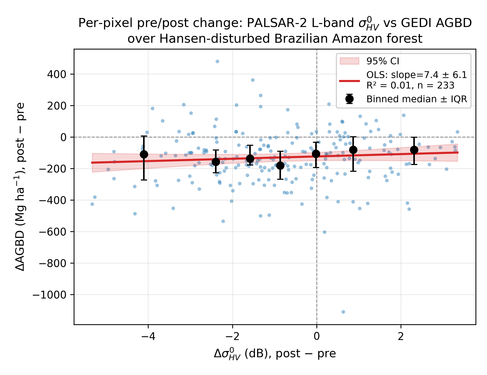

# GEDI × PALSAR-2 disturbance overlap (proposal figure)

A small, self-contained mini-project that produces a single proof-of-concept
figure for the NISAR proposal: **change in GEDI L4A above-ground biomass density
(ΔAGBD) versus change in PALSAR-2 ScanSAR L-band backscatter (primarily ΔHV in
dB) over Hansen-disturbed pixels in the Brazilian Amazon**.

This is not peer-reviewable science. It is a clean PoC scatter that supports
the proposal narrative: L-band backscatter change tracks GEDI-observed biomass
loss, and NISAR will improve on this baseline with denser revisits and dual-pol
acquisitions.

## Headline result



- **n = 233** pre/post pairs after quality filters (sensitivity ≥ 0.95,
  pre-AGBD ≥ 50 Mg ha⁻¹, full-power beams matched both sides, MAD-trimmed
  on ΔHV) over a 26° × 14° Brazilian Amazon AOI.
- Per-pixel scatter is dominated by L-band speckle, GEDI footprint
  geolocation (~10 m), and the 25 m PALSAR-2 sample buffer; the pixelwise
  OLS slope is +7.4 ± 6.1 Mg ha⁻¹ per dB ΔHV (R² = 0.006, p = 0.22).
- The binned-median overlay shows the signal hidden under the noise: pixels
  with the largest negative ΔHV exhibit ~80 Mg ha⁻¹ greater median biomass
  loss than pixels with positive ΔHV. Stratified by ΔAGBD, pixels losing
  > 50 Mg ha⁻¹ average ΔHV ≈ −1.2 dB versus −0.4 dB for stable/gain pixels.
- This is the expected proposal narrative: **the signal exists at the
  per-footprint scale even with PALSAR-2's mixed scan modes and sparse
  revisit, and NISAR's denser, calibration-stable, dual-pol L-band time
  series will strongly improve per-pixel SNR.**

Supplementary panels (`outputs/figures/supplementary_dhh_drfdi.png`) show
ΔHH (slope 8.2 ± 4.4, R² = 0.015) and ΔRFDI (slope 45 ± 51, R² = 0.003).
Full statistics in `outputs/figures/fit_stats.json`.

## Data sources

| Source | Asset | Role |
|---|---|---|
| GEDI L4A AGBD v2.1 | `LARSE/GEDI/GEDI04_A_002` (per-granule via `..._INDEX`) | Pre/post AGBD shot pairs |
| Hansen Global Forest Change v1.12 (2024) | `UMD/hansen/global_forest_change_2024_v1_12` | `lossyear ∈ {20, 21, 22}` mask |
| PALSAR-2 ScanSAR Level 2.2 | `JAXA/ALOS/PALSAR-2/Level2_2/ScanSAR` | HH and HV per pair |

## Pipeline

Run scripts in order from the repo root. Each step writes only to
[outputs/](outputs/) and is resumable (skips work whose output already exists).

```bash
# Phase 2: pre/post GEDI shot pairs over Hansen-disturbed pixels (~1–1.5 h on the large AOI)
python GEDI/Overlap/scale_pairs.py \
    --aoi GEDI/Overlap/data/aoi_amazon_frontier_large.geojson \
    --workers 8 --ee-project dyce-biomass

# Phase 3: PALSAR-2 ScanSAR HH/HV per pair (~minutes)
python GEDI/Overlap/sample_sar.py \
    --pairs GEDI/Overlap/outputs/pairs.parquet \
    --ee-project dyce-biomass

# Phase 4: filter, fit, plot
python GEDI/Overlap/make_figure.py \
    --pairs-with-sar GEDI/Overlap/outputs/pairs_with_sar.parquet
```

### Outputs

| File | Description |
|---|---|
| `outputs/pairs.parquet` | One row per pre/post GEDI pair (Hansen-disturbed, ≤25 m apart). Columns include `pre_lon, pre_lat, post_lon, post_lat, distance_m`, `pre_<f>` / `post_<f>` for each of `agbd, agbd_se, sensitivity, beam, shot_number, delta_time`, `tile_id`, `within_strict` (≤10 m). |
| `outputs/run_log.csv` | Per-tile diagnostics: bounds, n_pre, n_post, n_pairs, latency, status. |
| `outputs/tiles/<tile_id>.parquet` | Per-tile partial outputs (kept for resumability). |
| `outputs/pairs_with_sar.parquet` | `pairs.parquet` joined with `pre_HH_db, pre_HV_db, post_HH_db, post_HV_db, pre_BeamID, post_BeamID, pre_inc_near, post_inc_near, pre_sar_date, post_sar_date, sar_status`. Row count is preserved; HH/HV are NaN where no scene matched. |
| `outputs/sar_log.csv` | Per-chunk SAR sampling diagnostics. |
| `outputs/figures/delta_hv_vs_delta_agbd.png` and `.pdf` | Headline scatter (ΔHV vs ΔAGBD) with OLS fit, 95 % CI, annotation box. |
| `outputs/figures/supplementary_dhh_drfdi.png` and `.pdf` | Supplementary 2-panel: ΔHH and ΔRFDI on shared y-axis. |
| `outputs/figures/fit_stats.json` | slope, intercept, R², n, p for each panel. |
| `outputs/figures/decisions_log.md` | Records any deviation from default filters (e.g. relaxing `--min-sensitivity`). |

`outputs/try1/` is a recorded sanity-check run on the 0.5° Pará AOI
(`data/aoi_para_feasibility.geojson`) that produced 18 pairs, matching the
feasibility notebook's prior result.

## Folder layout

```
GEDI/Overlap/
  README.md            ← this file
  next_steps.md        ← forward-looking risks and follow-on plan
  scale_pairs.py       ← Phase 2 — tiled GEDI pre/post overlap discovery
  sample_sar.py        ← Phase 3 — PALSAR-2 ScanSAR per-pair sampling
  make_figure.py       ← Phase 4 — filter, fit, plot
  data/                ← AOIs (GeoJSON only; pyproj is broken in env)
  feasibility/         ← original investigation: notebook, report, sar_coverage.json
  outputs/             ← all generated artefacts (gitignored except figures)
  .cache/              ← internal GEDI INDEX cache
```

## Key design decisions

- **Pairing is local, not server-side.** GEE-side `ee.Join.inner` and
  `ee.Join.saveAll` both exceed the per-request memory cap when applied across
  the `sampleRegions(disturbed_mask).filter(dist=1)` chain on tiles with
  thousands of shots. Instead, each window's disturbance-filtered FC is pulled
  to a DataFrame via a single `getInfo()` and pairs are computed locally with
  `scipy.spatial.cKDTree` on an equirectangular projection (accurate to <1 m at
  25 m near the equator).
- **Tiles are 0.5° × 0.5°** snapped to a global grid; tiles with no Hansen
  loss are skipped via a cheap `reduceRegion(anyNonZero)`.
- **Quality filters are post-hoc**, applied in `make_figure.py`, not in
  `scale_pairs.py`. The master `pairs.parquet` stays raw so re-cuts are cheap.
- **PALSAR-2 calibration**: standard L2.2 conversion `σ⁰_dB = 10·log10(DN²) − 83.0`.
- **Time matching**: ±90 d window per side around the GEDI shot time
  (`delta_time` seconds since 2018-01-01 UTC); nearest-in-time scene is taken.
- **GEDI footprint**: sampled with a 12.5 m circular buffer at 25 m resolution
  (mean reducer).

## Reproducibility

- Environment: `nisar` micromamba env. `pyproj` is broken in this env so the
  scripts intentionally avoid `geopandas` / `pyproj`; AOI input is GeoJSON only.
- All scripts are idempotent: re-running skips tiles/chunks whose output
  parquets already exist.
- Earth Engine project: `dyce-biomass` (high-volume endpoint).

## Background

See [feasibility/](feasibility/) for the original 0.5° Pará investigation,
including method comparison ([feasibility/results_summary.csv](feasibility/results_summary.csv)),
PALSAR-2 ScanSAR coverage check
([feasibility/sar_coverage.json](feasibility/sar_coverage.json)), and the
exploratory notebook ([feasibility/notebook.ipynb](feasibility/notebook.ipynb)).
The feasibility notebook stays as-is; production paths live in the three
scripts above.
