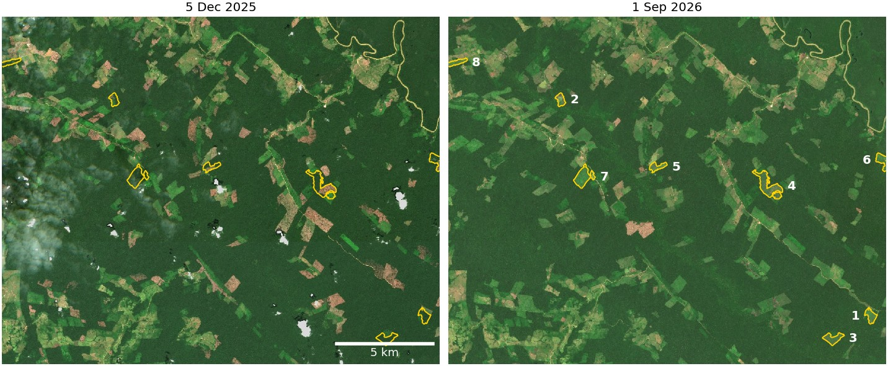
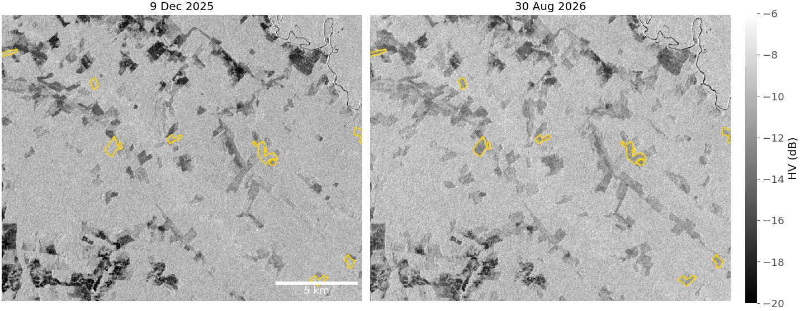
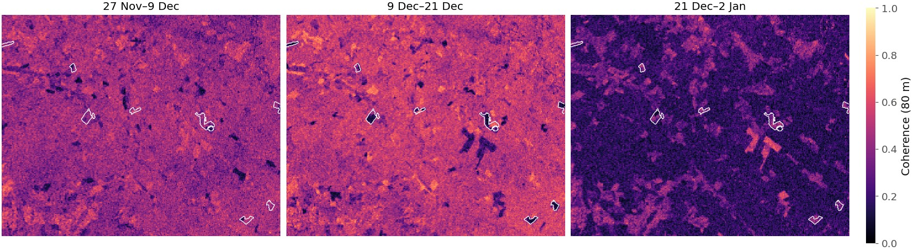
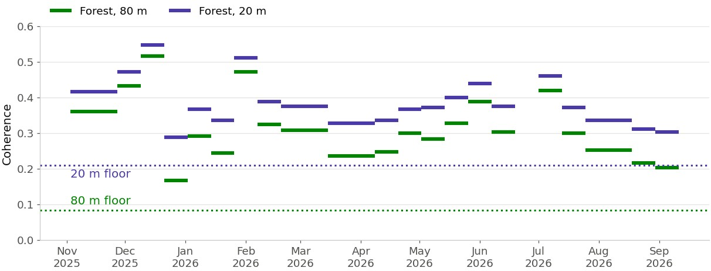
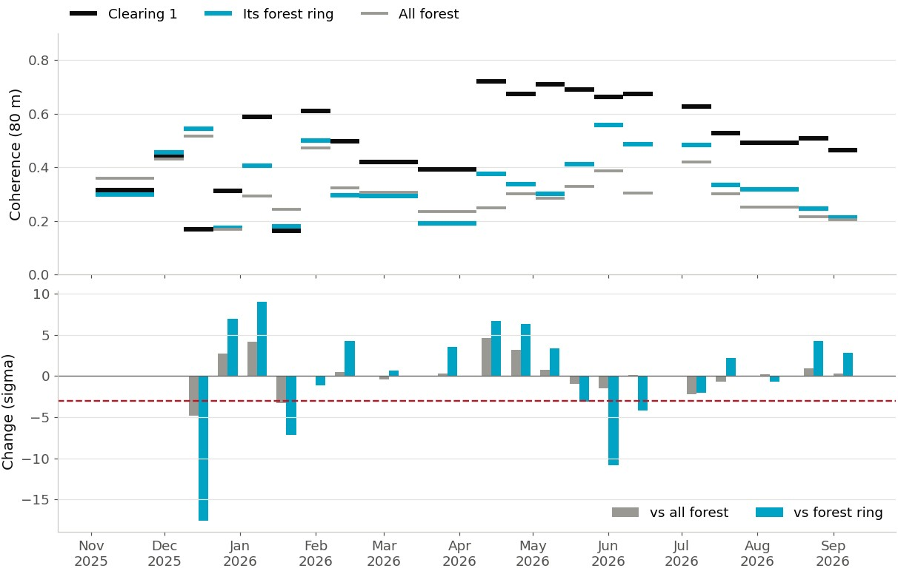
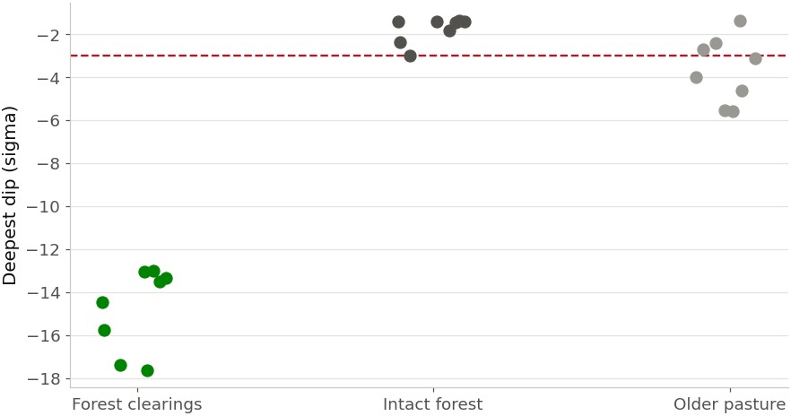
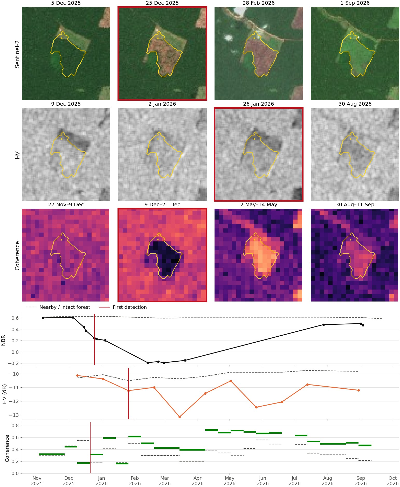
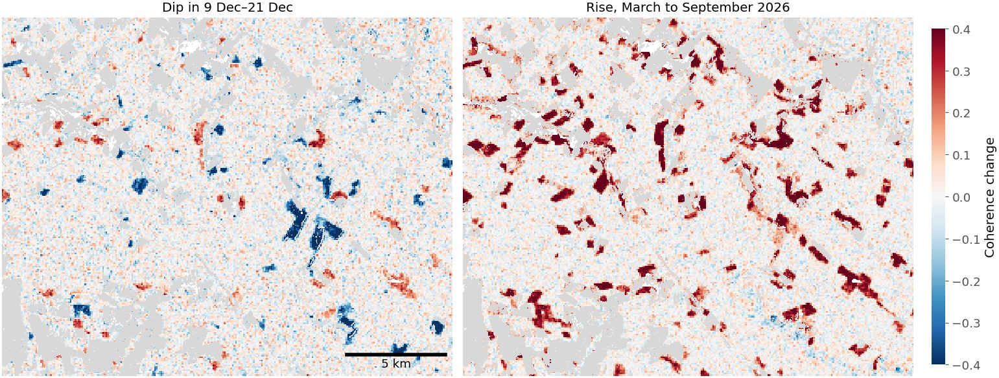
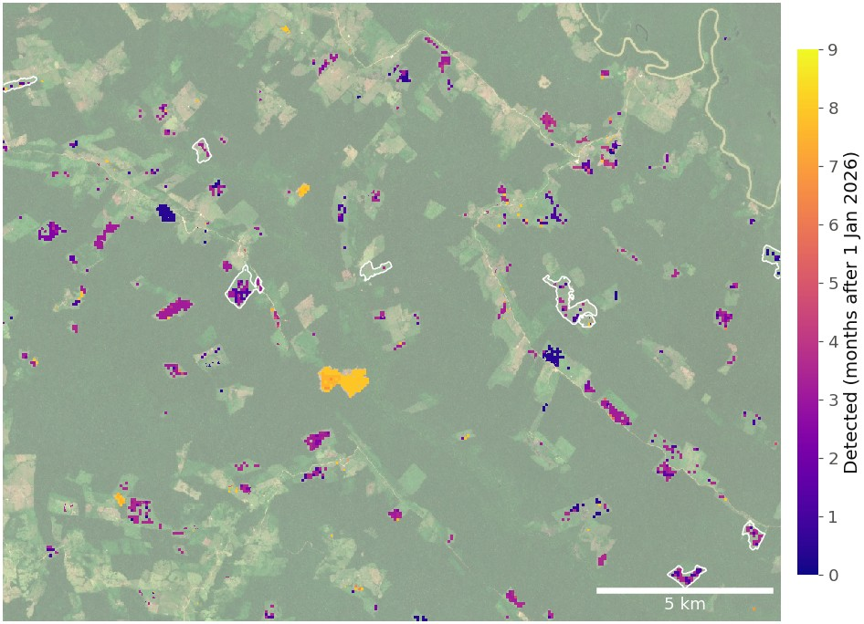

# Forest disturbance in Caquetá

How does a tropical forest clearing look to NISAR, and how early can we see it? This page summarizes a first analysis of PROVISIONAL NISAR data over a deforestation frontier in Caquetá, Colombia. The [forest disturbance tutorial](tutorials/11_disturbance_detection.ipynb) reproduces every figure here in about a minute, with no login, and the functions live in [`nice_sar.analysis.disturbance`](api/disturbance.md).

[Open the tutorial in Colab](https://colab.research.google.com/github/bullocke/nice-sar/blob/main/notebooks/11_disturbance_detection.ipynb){ .md-button .md-button--primary } [Read the rendered tutorial](tutorials/11_disturbance_detection.ipynb){ .md-button }

!!! warning "Preliminary results from PROVISIONAL data"
    NISAR products are calibrated but not yet validated, the record covers ten months, and the case studies number in the tens. Treat the numbers below as a first look, not as validated accuracies.

## The study area

The study area covers 22 × 18 km of NISAR frame 083 D 088, one of the supplemental frames processed back to November 2025. NISAR imaged it every 12 days, alternating dual-pol (HH + HV) and single-pol (HH) acquisitions. Between the two Sentinel-2 images below, hundreds of hectares of forest were felled and burned. Yellow outlines mark eight clearings drawn from Sentinel-2 that we follow in detail.

<figure markdown>

<figcaption>Sentinel-2 true colour on 5 December 2025 and 1 September 2026, with eight forest clearings outlined.</figcaption>
</figure>

## Three signals of clearing

### HV backscatter falls

Cross-polarized (HV) backscatter comes mostly from volume scattering in the canopy. Forest is bright (about −10 dB) and older pasture is dark (about −12 dB). Averaged over whole clearings, HV fell 1.0 to 1.8 dB relative to intact forest, and by 2 dB or more in their cores. A single-step fit to the HV series (`hv_step_dating`) dates each clearing from backscatter alone. Aligned on the date of their RADD alert (an operational alert based on Sentinel-1 C-band radar), clearing pixels start to lose HV about 50 days before the alert, and alerts come a median of 14 days after the HV step.

<figure markdown>

<figcaption>HV backscatter (3 × 3 boxcar in linear power) on the first and last dual-pol dates. The eight clearings turn from forest-bright to pasture-dark.</figcaption>
</figure>

### Coherence dips at felling, then rises

Interferometric coherence measures how similar two radar images taken 12 days apart are. Forest canopies move between passes, so forest coherence is already low. When trees are felled between the two dates of a pair, coherence drops further. Once the land is open, coherence rises well above forest and stays there.

<figure markdown>

<figcaption>80 m HH coherence in three consecutive pairs. In the 9 to 21 December pair, the clearings are dark holes in bright forest. In the next pair, rain has lowered coherence everywhere, unevenly.</figcaption>
</figure>

### But forest coherence is noisy

Two things make a raw coherence dip hard to see. First, coherence estimated from a few looks never reads zero: the floor is about 0.084 for the 80 m product (112 looks) and 0.21 for the 20 m product (18 looks). At 20 m the floor is much closer to forest coherence, which leaves less room for a dip, and 18-look estimates are noisier; across 1,286 clearing pixels the pair spanning a clearing stood out better at 80 m (AUC 0.66) than at 20 m (0.58), so detection relies on the 80 m product. Second, rain lowers coherence in patches, by very different amounts from one pair to the next.

<figure markdown>

<figcaption>Median coherence of intact forest in each 12 or 24 day pair, at 80 m and 20 m posting, with the coherence floors (dotted). The rainy 21 December to 2 January pair falls to 0.17 at 80 m.</figcaption>
</figure>

## Measuring dips against the right reference

Two changes turn the noisy record into a clear signal:

1. **Nearby forest as the weather reference.** Instead of intact forest across the whole scene, compare each area with a ring of intact forest 80 to 300 m around it (`forest_ring`). Nearby forest shares the local weather, which lowers the noise two to three times.
2. **The area's own history.** Compare each pair with the median of the area's three previous pairs (`own_history_change`). This captures felling of forest, but also burning of land that was already cleared, which can drop a long way while staying at forest level.

Changes are expressed in sigma: multiples of the chance variation of intact-forest areas of the same size (`forest_change_noise`). A dip is flagged below −3 sigma (`coherence_dips`), a threshold at which 4 to 8% of intact-forest areas show a false dip anywhere in the ten-month record.

<figure markdown>

<figcaption>Top: 80 m coherence of clearing 1, its forest ring and all intact forest. Bottom: change from the clearing's own history in sigma. The felling pair (9 to 21 December) reaches −17.6 sigma against the ring but only −4.8 sigma against all forest. The dashed line is the −3 sigma threshold.</figcaption>
</figure>

Against their forest rings, the eight clearings dipped 13 to 18 sigma below their own history. Intact-forest controls stayed above −3 sigma. Older pasture is the caveat: burning or ploughing already-open land also lowers coherence, and five of eight pasture controls crossed the forest-calibrated threshold at least once. Non-forest land needs its own calibration.

<figure markdown>

<figcaption>Deepest coherence dip (sigma, ring reference) for eight forest clearings, eight intact-forest squares and eight older-pasture squares.</figcaption>
</figure>

## One clearing, three sensors

<figure markdown>

<figcaption>Clearing 1 (26 ha). Sentinel-2 shows the felling between 5 and 25 December 2025. The 80 m coherence dip in the 9 to 21 December pair detects it at the same time. HV falls more gradually as the felled trees dry and burn, and is first detected on 26 January. Red frames and lines mark each sensor's first detection.</figcaption>
</figure>

## Across the whole scene

The same ideas work pixel by pixel, with an 820 m moving window of intact forest in place of the ring. Shown only for land that was forest in November 2025, the felling pair picks out the December clearings, and the months that follow show the lasting rise in coherence over new open land. About 70% of the cells that rose by more than 0.2 fall inside RADD alerts from this period, and about 15% lie within 100 m of an older clearing, where an 80 m cell mixes forest and pasture.

<figure markdown>

<figcaption>Left: change in 80 m coherence in the 9 to 21 December pair relative to each cell's earlier pairs, after removing nearby forest. Right: median rise from March to September 2026. Grey: land already cleared before November 2025.</figcaption>
</figure>

## Toward a detection system (experimental)

A detection system has to work without outlines. `disturbance_index` processes images in date order, standardizes each against the current forest after removing each pixel's own mean, and flags a pixel after two exceedances in a row. Monitoring all land that was forest in November 2025 and looking for a sustained rise in 80 m coherence, it flagged 28% of the area of the eight clearings and 19% of high-confidence RADD alerts since November, against 0.3% of stable forest. In a first validation against 128 reference clearings it caught 26% on time, so the method needs more work before it can be used operationally.

<figure markdown>

<figcaption>Pixels flagged by the experimental Disturbance Index (sustained rise in 80 m coherence), coloured by detection date, over Sentinel-2.</figcaption>
</figure>

## Limitations

- **PROVISIONAL data and a short record.** Ten months of data, one frame and tens of case studies.
- **Masked pairs.** When rain pushes forest coherence close to the floor, a clearing cannot lower it further. `coherence_dips` marks pairs whose reference forest coherence is below 0.30 as masked instead of testing them.
- **Non-forest land.** Thresholds calibrated on forest flag some changes on pasture.
- **Reference data.** Clearing outlines come from Sentinel-2 and RADD alerts, which have their own timing errors. Gaps in cloud-free Sentinel-2 imagery (April to July) widen the reference dates.

## Reproduce and extend

- [Tutorial 11](tutorials/11_disturbance_detection.ipynb) reproduces this page from a 40 MB demo bundle (`nice_sar.datasets.load_caqueta_demo`).
- [`scripts/caqueta/`](https://github.com/bullocke/nice-sar/tree/main/scripts/caqueta) holds the full analysis, with case studies in six categories, the matched-null test of the spanning pair (AUC 0.66 at 80 m, 0.58 at 20 m) and the calibration of every threshold.
- [`nice_sar.analysis.disturbance`](api/disturbance.md) documents each function.
