---
hide:
  - toc
---

# Gallery

One figure from each tutorial, all from PROVISIONAL NISAR data. Every image is the saved output of its notebook, so it updates whenever the tutorials are re-run. Click an image to open the tutorial.

-   [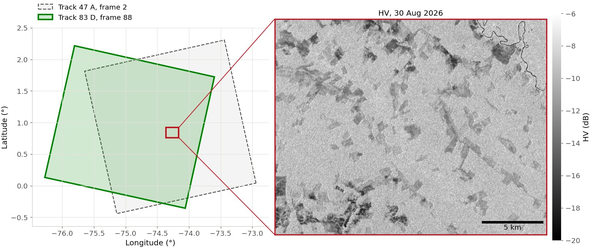](tutorials/00_data_discovery.ipynb)

    **00 · Data discovery**

    Two NISAR frames cover the study area; the window shows HV backscatter from one granule.

    

-   [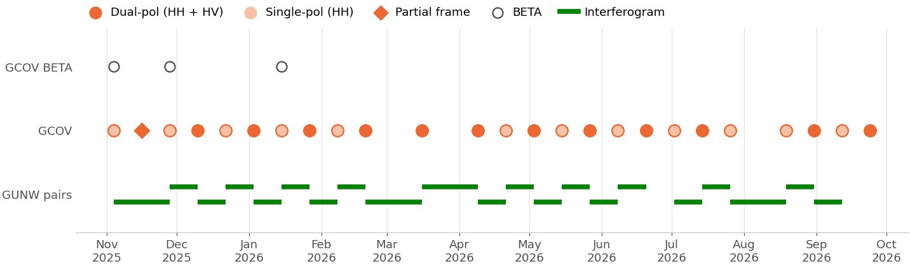](tutorials/01_search_and_download.ipynb)

    **01 · Search and download**

    Every acquisition over Caquetá: dual-pol and single-pol dates alternate every 12 days.

    

-   [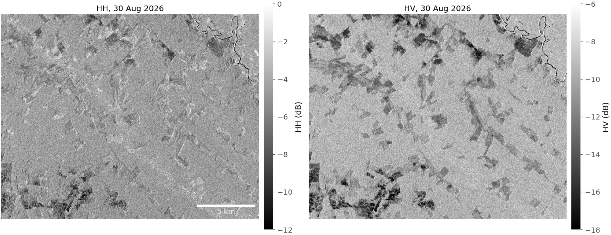](tutorials/02_read_gcov.ipynb)

    **02 · Read GCOV**

    HH and HV backscatter streamed for a 22 × 18 km window. Pastures are dark in HV.

    

-   [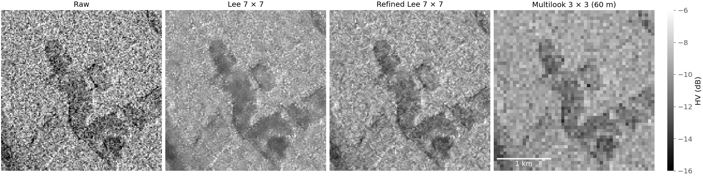](tutorials/03_preprocessing.ipynb)

    **03 · Speckle and multilooking**

    Raw speckle, Lee and refined Lee filters, and 3 × 3 multilooking around a clearing.

    

-   [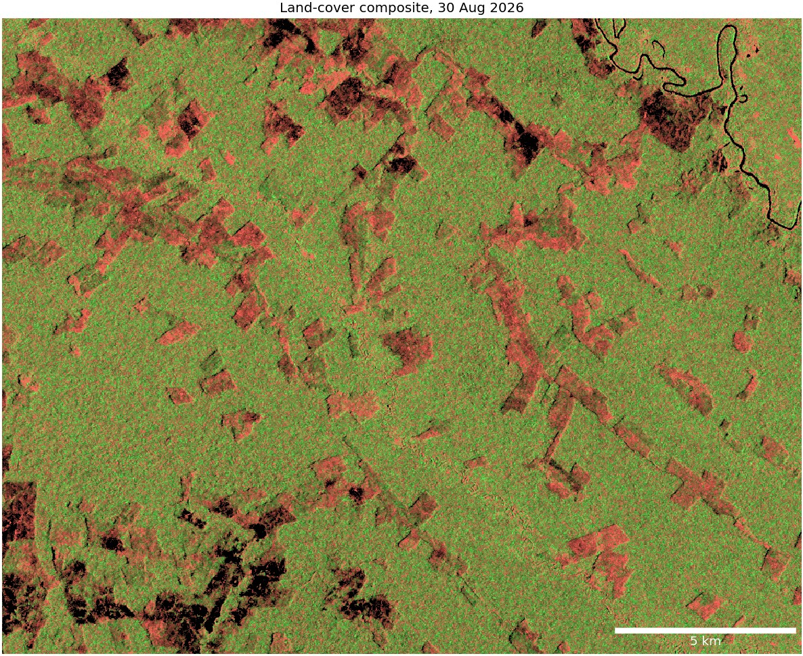](tutorials/04_rgb_composites.ipynb)

    **04 · RGB composites**

    A dual-pol land-cover composite: forest green, pasture salmon, rivers and bare ground dark.

    

-   [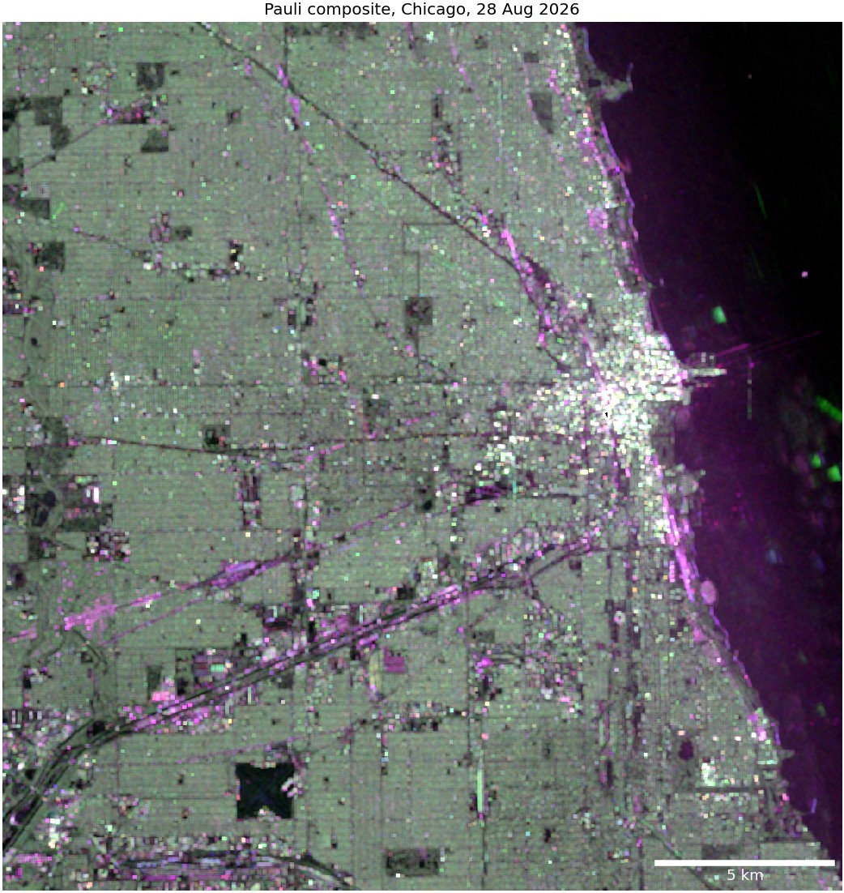](tutorials/05_polarimetric_analysis.ipynb)

    **05 · Polarimetry**

    A quad-pol Pauli composite of Chicago: double bounce in the city, surface scattering on the lake.

    

-   [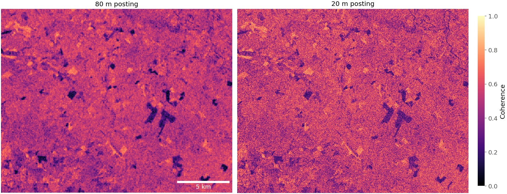](tutorials/06_insar_coherence.ipynb)

    **06 · InSAR coherence**

    12-day coherence at 80 m and 20 m posting. December clearings are dark holes in the forest.

    

-   [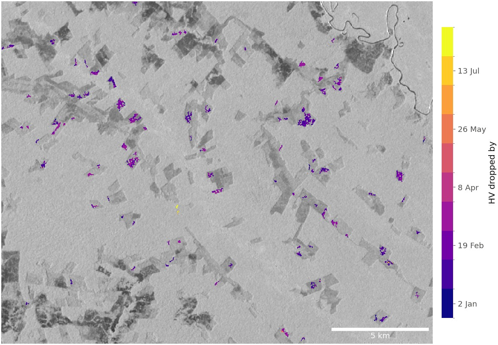](tutorials/07_timeseries_change.ipynb)

    **07 · Time-series change**

    When HV dropped: CUSUM change dates for new clearings, over mean HV.

    

-   [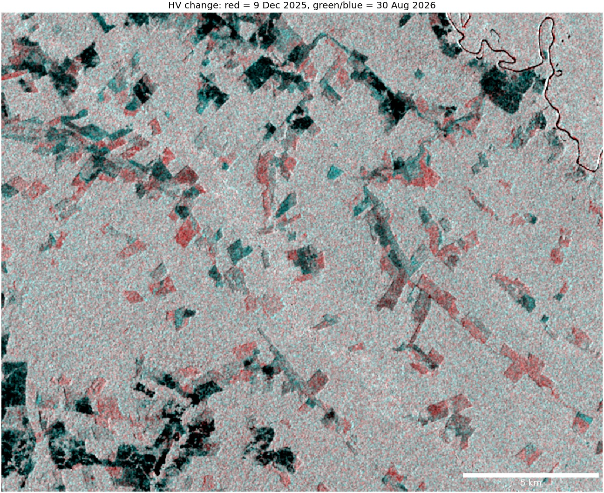](tutorials/08_subset_download.ipynb)

    **08 · Subset download**

    Two subsets, eight months apart, combined into one image: forest cleared in between shows red.

    

-   [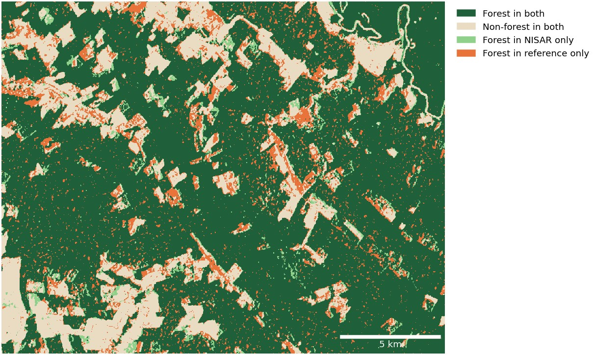](tutorials/09_forest_masks.ipynb)

    **09 · Forest masks**

    An HV-threshold forest mask compared pixel by pixel with a RADD-based forest reference.

    

-   [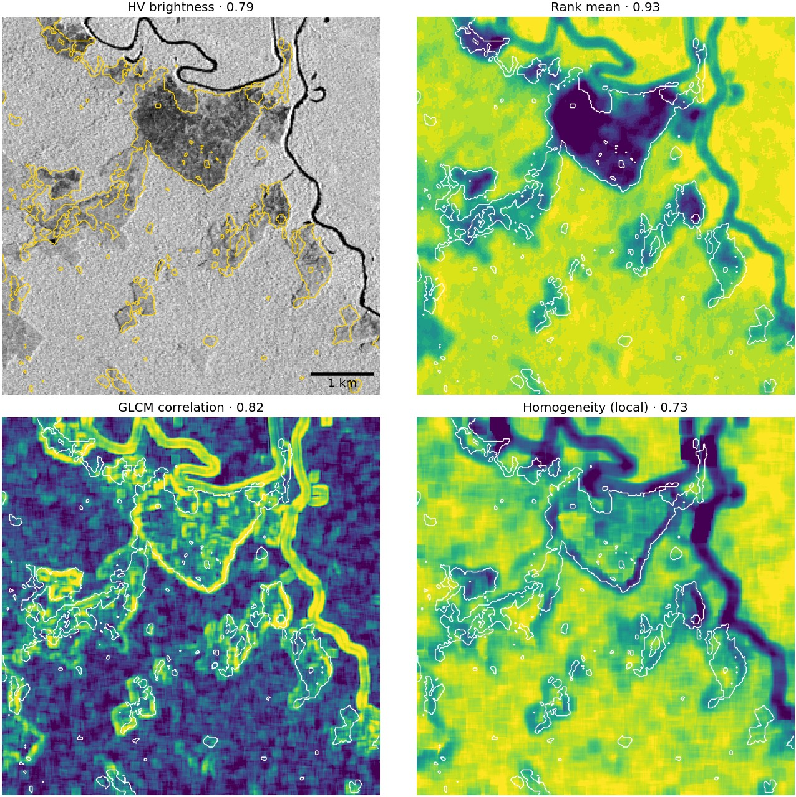](tutorials/10_texture_comparison.ipynb)

    **10 · Texture**

    Brightness and texture features, each with its forest-pasture separability (AUC).

    

-   

    **11 · Forest disturbance**

    One clearing, three sensors: coherence dips at felling, HV falls as the land opens up.

    

